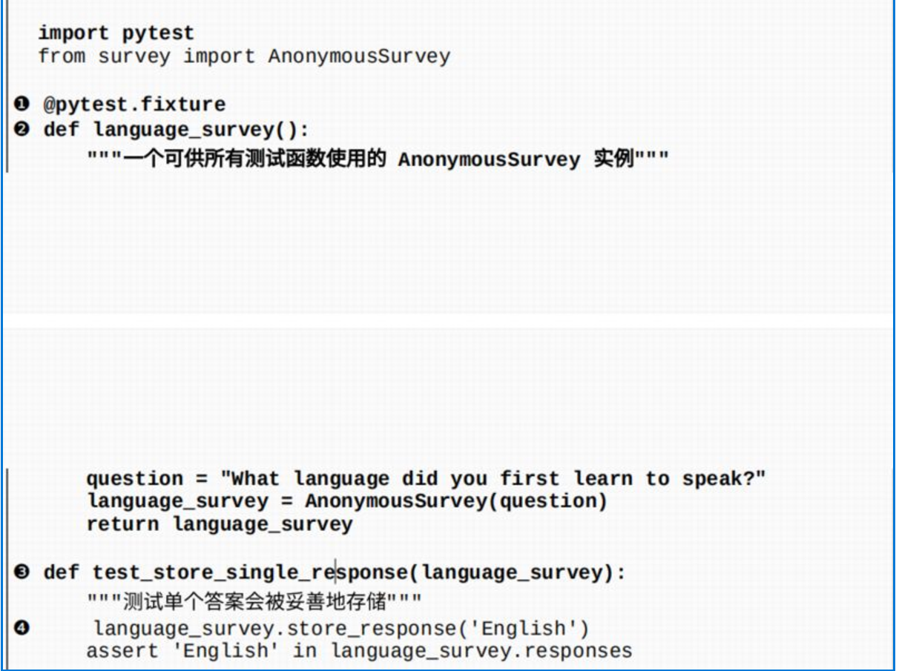
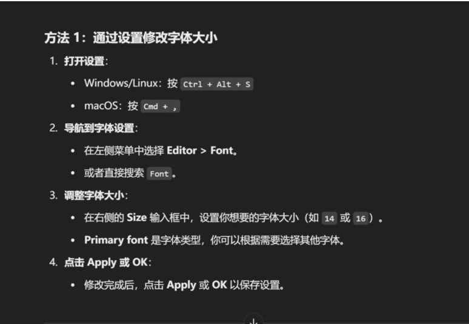
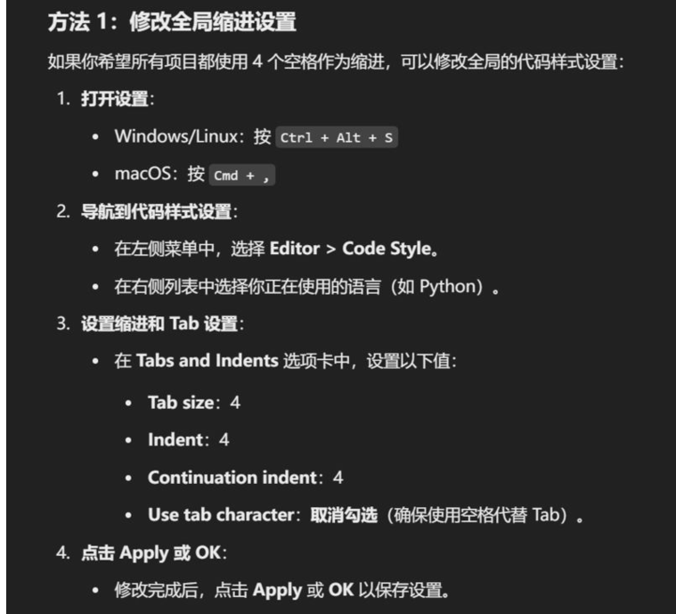
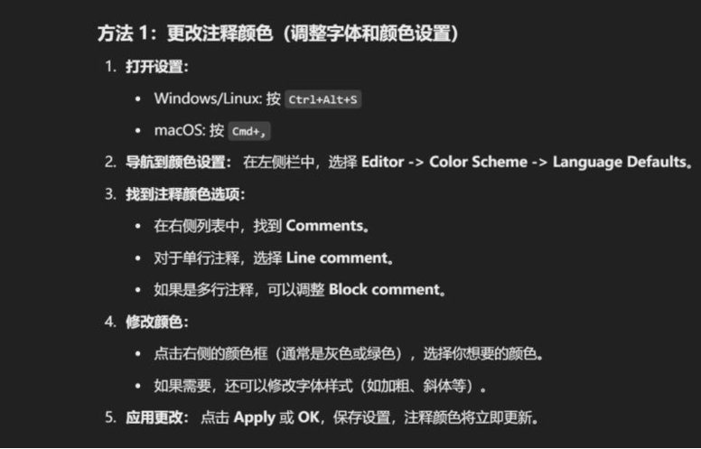
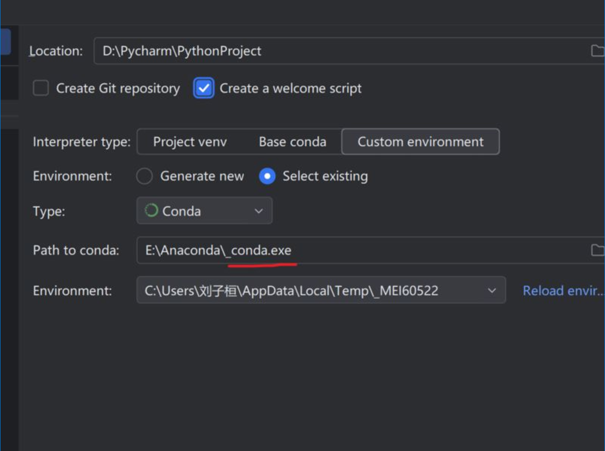
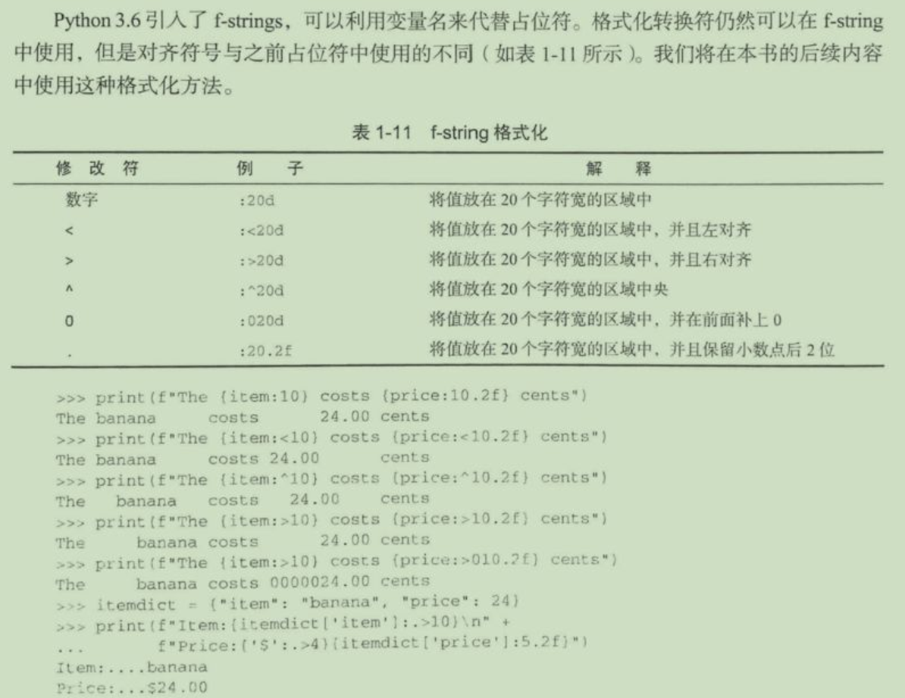

# 语法问题

## 列表是数组吗？

### 定义

> **数组**：需要一组连续的内存空间，存储的变量需要是同一类型的，数字是数字，字符串是字符串

> **列表**：无以上限制，是否需要连续空间也未可知

### 空间申请

数组需要一开始申请到一个小的空间，而列表不需要，列表的初始内存（动态变化的)就和最终的内存地址是一致的，且申请的内容可以十分巨大

### 列表可视化

列表是采用分离式技术的**动态顺序表**


可以发现**列表的表头是不会变化的**，表头分别代表：1、最大存储元素；2、当前存储元素；3、表头地址，其运用的技术是动态扩容，开始申请4个空间（4*8），后面内存不够就再继续申请空间为8个空间，最后将数据迁移过去

## 实参和行参

``` python
def greet_user(user_name):
    ''' 显示简单的问候语'''
    print(f'Hello,{user_name.title()}.')
   
greet_user('jeff')
```

这里面``user_name``是行参——即函数完成工作所需的信息<br>``jeff``是实参——即函数完成工作所需要的信息

## 路径问题

在引用函数或者类或者是本地文件，会遇到大量的路径问题，以下给出部分的函数功能能查找和添加 console 的路径问题，以减少错误

### 格式化路径

`````py
# 在路径前面添加 r 可以不出现路径\的错误
# ex:r"C:\Users\***\PycharmProjects\practice\Python编程：从入门到实践"
`````

### os库

`````py
# os 库
import os
os.getwd()	# 获取当前文件夹的路径名
os.chdir()	# 修改环境路径
`````

### sys库

`````py
# sys库
import sys
# 扩展搜索路径，在调用类和函数时可以使用
sys.path.append()	
for path in sys.path:
	print(path)
`````

### pathlib库

```py
# pathlib 库
from pathlib import Path
path = Path()	
```

## map函数和join函数

### map函数

可以用来转化数据格式

```py
# map
# map(function, iterable, ...)
numbers = [1, 2, 3, 4]
map(str, numbers)	# str 作用于 numbers 里面的每个对象
					# interable 为可迭代对象
```

### join函数

用来拼接字符串且必须为字符串的形式，拼接的对象是可迭代的

```py
# join()
# 用‘，’来顺序连接numbers的字符 可搭配map使用
",".join(str(numbers))	# 
```

## Git

### 查看Git是否被ssh连接

```pyth
# git_bash git的终端
ssh -T git@github.com
```

### GitHubDesktop（最简单方式）

- 本地创建仓库，然后GitHubDesktop导入仓库后就可以很方便的提交修改了，也可以直接到本地文件夹内直接修改内容本地建立完成后，在仓库内可直接commit项目。

## 文本格式转化

**转换为json格式**

```python
import json

name = 'huan'
name_json = json.dumps(name)   # 转化为json格式一般在 准备写入文档时用
name_json = json.loads(name)   # 接受json格式的文档一般在 准备读入文档时用
```

## 测试代码

- **测试代码库**

```python
# 安装
pip install pytest
import pytest
```

- **单元测试**

```python
# 断言
assert # +测试条件
```

- **夹具的使用**

```python
import pytest
form 文件名 import 类名     # 文件名是含text_

@pytest.fixture
def 测试函数示例():       # 函数内的参数会被用到下面的测试函数中,用于反复重复运用的代码
    question = ''
    return question

def 测试函数(测试函数的实例)
    .....
    assert 测试条件
```



## 安装和更新包

### 安装包的手段

```python
-m pip install --user package-name # 无虚拟环境
pip install package_name # 有虚拟环境时，此时使用--user会报错
```

### 更新包的手段

```python
# 在终端运行
python -m pip install --upgrade package_name # python -m pip 是用来运行pip模块
                                             # install --upgrade package_name 是更新包
```

## pycharm系统设置

### 修改字号



### 修改tab的缩进大小



### 修改注释颜色



## Anaconda创建虚拟环境

### 在Anaconda prompt中配置

```python
#base 环境操作

# 列出conda的环境
conda env list

# 创建环境名（如DL）的虚拟环境， 指定python版本
conda create -n 环境名（如DL）python=3.9  [版本随意]

# 如果想在不同与conda盘的路径安装环境，可以额外添加路径
conda create --prefix=安装路径\环境名 python=3.9 

#    删除环境名
conda remove -n 环境名 -all

# ===进入虚拟环境===
conda activate 环境名
```

### 在虚拟环境中操作

```python
# 进入虚拟的环境，命令行前面会显示（环境名）

# 列出环境的库
conda list

# 下载库
conda install 库（==指定的版本）

# 查看环境里面的具体库
pip show 库

# 退出虚拟环境（重启命令窗就行）
conda deactivate

# 环境复制
conda create --name (new_env_name) --clone (old_env_name)
```

### 注意事项

**pycharm中的操作[新建的时候注意这个是输入_conda.exe文件，而不是python.exe文件就行**



## f—string（字符串格式化）



## 数据读取

### csv格式数据读取

1. 导入库

```python
from pathlib import Path
import csv
from datetime improt datetime # 时间读取包
```

2. 导入数据

```python
# -- 以字符串的形式载入
path = Path(r'文件存储路径')
liens = path.read_text().splitlines()

# -- 存储为可识别的python格式
reader = csv.reader(lines)
# 1. 首行读取
head_row = next(reader)
# 2. 头行索引读取
for index, label in enumerate(head_row)
    print(index, label) 
read.csv()        # 创建的文档如果读取过一次，就会被消耗

```

### JSON格式读取

```python
from pathlib import Path
import json

path = Path(r'路径')
contents = path.read_txt()
readers = json.loads(contents)

# -- 存储为 便于读的形式
# 1. 存储路径
path = Path(r'')
# 2. 格式修改 indent = 4 增加缩进
readeable = json.dumps(readers, indent=4)
# 3. 文件写入
path.write_text(readable)
```


