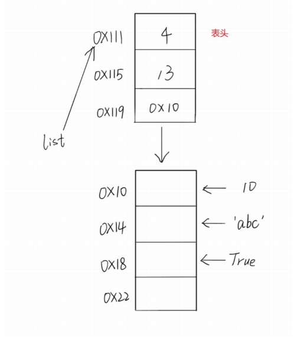

# 语法问题

## 列表是数组吗？

### 定义

> **数组**：需要一组连续的内存空间，存储的变量需要是同一类型的，数字是数字，字符串是字符串

> **列表**：无以上限制，是否需要连续空间也未可知

### 空间申请

数组需要一开始申请到一个小的空间，而列表不需要，列表的初始内存（动态变化的)就和最终的内存地址是一致的，且申请的内容可以十分巨大

### 列表可视化

列表是采用分离式技术的**动态顺序表**



可以发现**列表的表头是不会变化的**，表头分别代表：1、最大存储元素；2、当前存储元素；3、表头地址，其运用的技术是动态扩容，开始申请4个空间（4*8），后面内存不够就再继续申请空间为8个空间，最后将数据迁移过去

## 实参和行参

``` python
def greet_user(user_name):
    ''' 显示简单的问候语'''
    print(f'Hello,{user_name.title()}.')
   
greet_user('jeff')
```

这里面``user_name``是行参——即函数完成工作所需的信息<br>``jeff``是实参——即函数完成工作所需要的信息

## 路径问题

在引用函数或者类或者是本地文件，会遇到大量的路径问题，以下给出部分的函数功能能查找和添加 console 的路径问题，以减少错误

### 格式化路径

`````py
# 在路径前面添加 r 可以不出现路径\的错误
# ex:r"C:\Users\刘子桓\PycharmProjects\practice\Python编程：从入门到实践"
`````

### os库

`````py
# os 库
import os
os.getwd()	# 获取当前文件夹的路径名
os.chdir()	# 修改环境路径
`````

### sys库

`````py
# sys库
import sys
# 扩展搜索路径，在调用类和函数时可以使用
sys.path.append()	
for path in sys.path:
	print(path)
`````

### pathlib库

```py
# pathlib 库
from pathlib import Path
path = Path()	
```

## map函数和join函数

### map函数

可以用来转化数据格式

```py
# map
# map(function, iterable, ...)
numbers = [1, 2, 3, 4]
map(str, numbers)	# str 作用于 numbers 里面的每个对象
					# interable 为可迭代对象
```

### join函数

用来拼接字符串且必须为字符串的形式，拼接的对象是可迭代的

```py
# join()
# 用‘，’来顺序连接numbers的字符 可搭配map使用
",".join(str(numbers))	# 
```


 


